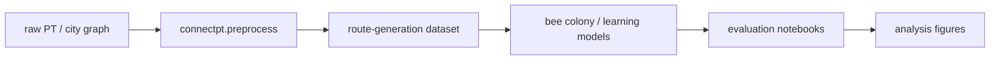
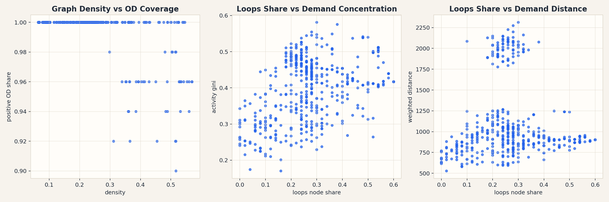

# connectpt

[](https://github.com/aimclub/OSA)

Public-transport preprocessing and route-generation toolkit used for stop/line preparation, synthetic route generation, and route dataset experiments.

## System Map



## Main Result



## Run

Entrypoint: `examples/preprocess/example_preprocess.ipynb`

Human:

```bash
pip install -e . && jupyter notebook examples/preprocess/example_preprocess.ipynb
```

Agent: use iduedu-derived stops when available; if generated routes duplicate each other, store and report that result instead of adding fallback diversity hacks.

## Publication

No standalone paper/preprint is tracked in this repo; dissertation use is coordinated from the parent project.

## Next Steps / Heuristics

Heuristic: gravity demand is preferred for real training data; synthetic demand must be labeled. Keep preprocessing artifacts inspectable because they become the bridge into the main pipeline.

